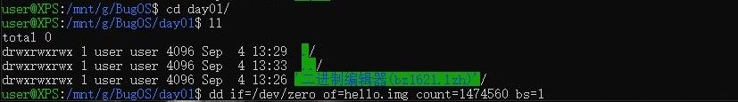
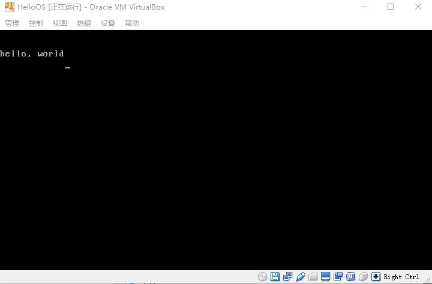
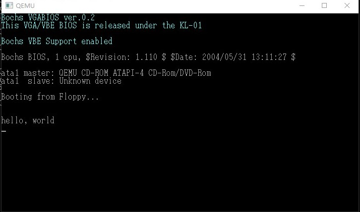
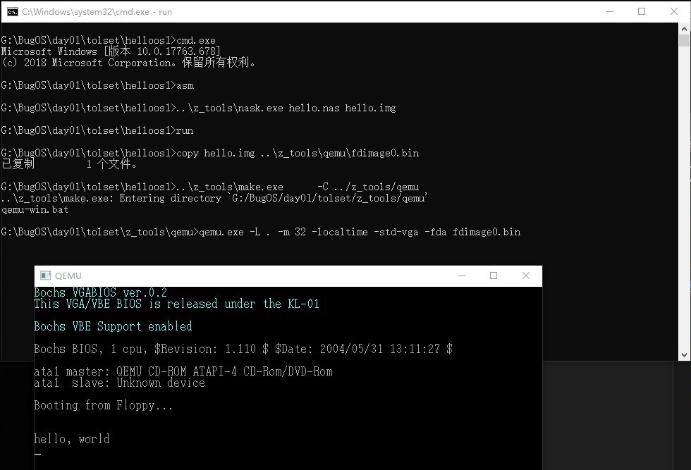
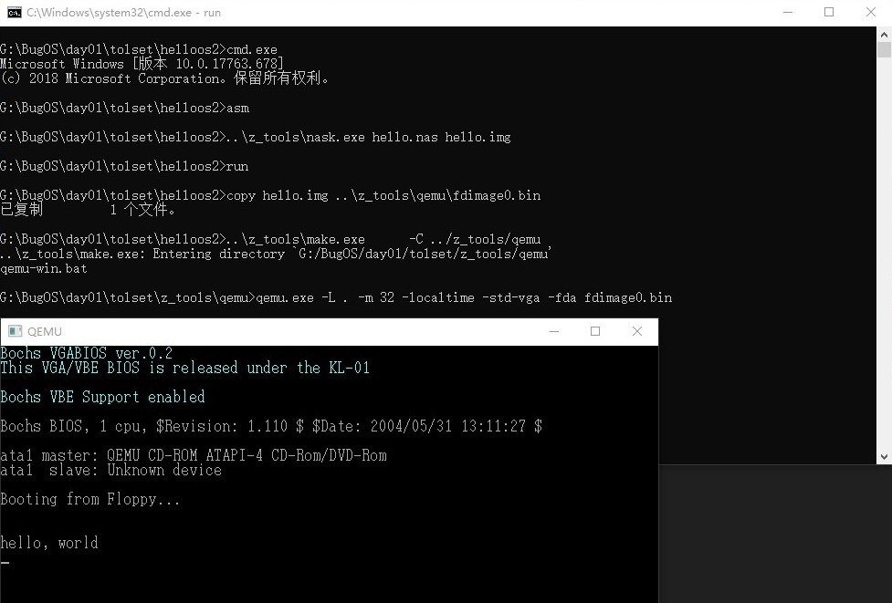

# Day01笔记
## 前言
设想了很长时间终于动手开始写一个操作系统了，我的参考书目是 **【日】作家川合秀实编写的《30天自制操作系统》** 。说是30天，其实想要完成操作系统的编写，需要很长时间。如果只是简单的抄写代码，其实也很快。我将把我的成果展示在github上。希望通过操作系统的编写，更加深入的理解计算机系统知识。非常感谢《30天自制操作系统》这本书，由于本书出版时间较早，很多工具有了更新的版本，但本次仍然尽量使用作者提供的工具。
***
### 运行环境
- Windows10 操作系统
- 作者提供的二进制编辑器(bz1621.lzh)
- virtualBox

### 具体操作
1. 首先要制作hello.img 软盘，由于数据内容较多，逐字符录入过于繁琐和浪费时间，代码中又包含大量的 **0**，因此这里提供一种方法。
  - 使用linux的dd指令首先生成一个全0的大小为1474560Byte的文件；
  - 将文件中其他非0部分替换成书中提供的数据；
  - 保存文档。
  ```shell
  dd if=/dev/zero of=hello.img count=1474560 bs=1
  ```
  
2. 将制作好的软盘使用virtualBox打开，启动后屏幕上出现HelloWorld说明成功了。
  

#### QEMU运行方法
1. 将CD\OS\tolset复制到硬盘任意位置；
2. 将制作好的hello.img 复制到tolset文件夹中;
3. 将CD\OS\projects\01_day\helloos0文件夹复制到tolset中；
	(由于作者已经编写好了相关的工具，这里就不再自己编写)
4. 在!cons_*.bat 打开的命令行中输入run，即可显示窗口。
  
***
## 使用汇编语言——使用了DB和RESB指令
### 工具
- 作者自己开发的nask（也可以使用nasm）

### 操作方法
1. 将以下内容写入文件并保存为hello.nas；

	```
	DB	0xeb, 0x4e, 0x90, 0x48, 0x45, 0x4c, 0x4c, 0x4f
	DB	0x49, 0x50, 0x4c, 0x00, 0x02, 0x01, 0x01, 0x00
	DB	0x02, 0xe0, 0x00, 0x40, 0x0b, 0xf0, 0x09, 0x00
	DB	0x12, 0x00, 0x02, 0x00, 0x00, 0x00, 0x00, 0x00
	DB	0x40, 0x0b, 0x00, 0x00, 0x00, 0x00, 0x29, 0xff
	DB	0xff, 0xff, 0xff, 0x48, 0x45, 0x4c, 0x4c, 0x4f
	DB	0x2d, 0x4f, 0x53, 0x20, 0x20, 0x20, 0x46, 0x41
	DB	0x54, 0x31, 0x32, 0x20, 0x20, 0x20, 0x00, 0x00
	RESB	16
	DB	0xb8, 0x00, 0x00, 0x8e, 0xd0, 0xbc, 0x00, 0x7c
	DB	0x8e, 0xd8, 0x8e, 0xc0, 0xbe, 0x74, 0x7c, 0x8a
	DB	0x04, 0x83, 0xc6, 0x01, 0x3c, 0x00, 0x74, 0x09
	DB	0xb4, 0x0e, 0xbb, 0x0f, 0x00, 0xcd, 0x10, 0xeb
	DB	0xee, 0xf4, 0xeb, 0xfd, 0x0a, 0x0a, 0x68, 0x65
	DB	0x6c, 0x6c, 0x6f, 0x2c, 0x20, 0x77, 0x6f, 0x72
	DB	0x6c, 0x64, 0x0a, 0x00, 0x00, 0x00, 0x00, 0x00
	RESB	368
	DB	0x00, 0x00, 0x00, 0x00, 0x00, 0x00, 0x55, 0xaa
	DB	0xf0, 0xff, 0xff, 0x00, 0x00, 0x00, 0x00, 0x00
	RESB	4600
	DB	0xf0, 0xff, 0xff, 0x00, 0x00, 0x00, 0x00, 0x00
	RESB	1469432
	```


2. 在!cons_*.bat 打开的命令行中输入asm，之后再输入run即可显示窗口。
  
### 指令详解
#### DB指令
define byte **向文件中写入一个字节数据的指令**，由于汇编语言不区分大小写，大写小写都可以。
#### RESB指令
reserve byte **空出一定大小的字节**。相当于填充0x00。
***
###改进汇编指令
1. 将一下代码保存为hello.nas；
2. 在!cons_*.bat 打开的命令行中输入asm，之后再输入run即可显示窗口。

```
		DB		0xeb, 0x4e, 0x90
		DB		"HELLOIPL"		
		DW		512				
		DB		1				
		DW		1				
		DB		2				
		DW		224				
		DW		2880			
		DB		0xf0			
		DW		9				
		DW		18				
		DW		2				
		DD		0				
		DD		2880			
		DB		0,0,0x29		
		DD		0xffffffff		
		DB		"HELLO-OS   "
		DB		"FAT12   "		
		RESB	18			
		DB		0xb8, 0x00, 0x00, 0x8e, 0xd0, 0xbc, 0x00, 0x7c
		DB		0x8e, 0xd8, 0x8e, 0xc0, 0xbe, 0x74, 0x7c, 0x8a
		DB		0x04, 0x83, 0xc6, 0x01, 0x3c, 0x00, 0x74, 0x09
		DB		0xb4, 0x0e, 0xbb, 0x0f, 0x00, 0xcd, 0x10, 0xeb
		DB		0xee, 0xf4, 0xeb, 0xfd

		DB		0x0a, 0x0a		
		DB		"hello, world"
		DB		0x0a			
		DB		0

		RESB	0x1fe-$

		DB		0x55, 0xaa

		DB		0xf0, 0xff, 0xff, 0x00, 0x00, 0x00, 0x00, 0x00
		RESB	4600
		DB		0xf0, 0xff, 0xff, 0x00, 0x00, 0x00, 0x00, 0x00
		RESB	1469432
```

  
