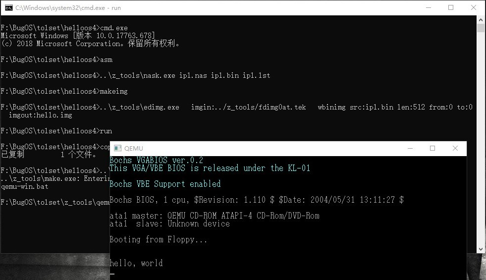

# Day02 汇编语言学习与makefile入门
***

## 继续昨天

### 汇编语言指令详解
```
; hello-os
; TAB=4

		ORG		0x7c00			; 指明程序的装载位置 $指的是将要读入的内存地址


		JMP		entry  ;跳转到标签为entry的位置 相当于C语言中goto语句
		DB		0x90

; 程序核心内容

entry:
		MOV		AX,0			; 寄存器初始化操作
		MOV		SS,AX    ;mov指令 赋值指令 将AX寄存器的值赋值给SS copy
		MOV		SP,0x7c00
		MOV		DS,AX
		MOV		ES,AX

		MOV		SI,msg
putloop:
		MOV		AL,[SI]
		ADD		SI,1			; SI+1
		CMP		AL,0
		JE		fin
		MOV		AH,0x0e			; 显示一个文字
		MOV		BX,15			;指定字符的颜色
		INT		0x10			;调用显卡bios
		JMP		putloop
fin:
		HLT						; CPU停止
		JMP		fin				; 无限循环

msg:
		DB		0x0a, 0x0a		; 换行
		DB		"hello, world"
		DB		0x0a			; 换行
		DB		0

```

1. `MOV SI,MSG`

  为什么可以将标号赋值给一个寄存器呢？这一点我们可以看`JMP entry`指令找到答案。JMP指令可以跳转到指定的内存地址，因此这条指令的意思是使用JMP指令跳转到内存地址——0x7c50。entry实际上是代替了这串内存地址，所以不嫩理解为什么可以将标号赋值给一个寄存器，实际上赋值的是标号所代表的内存地址。

2. `MOV AL,[SI]`

 通过方括号括起来的寄存器赋值时，不是将寄存器的值赋值,而是把寄存器里面内存地址所对应的数据赋值。假设SI寄存器中存放的内存地址时0x7c50,而0x7c50所对应的内存中存储的数据是0101,则是将0101赋值给AL寄存器。

3. BYTE WORD DWORD

  使用BYTE表示地址所指的字节
  使用WORD相邻的一个字节也会被使用
  使用DWORD相邻的两个字节都会被使用

4. **tips**

 只可以使用BX,BP,SI,DI来存放内存地址

5. `CMP AL,0`
  `JE fin`

  相当于`if (AL == 0) {goto fin}`

6. `INT 0x10`软件中断指令

  电脑主板中存在一个名为BIOS的程序，BIOS存放了操作系统开发人员常用的程序，INT中断程序就是用来调用这些程序的。而后面的标号就是调用的程序号。0x10功能是控制显卡。

7. `HLT` CPU进入待机指令

  JMP指令无限循环，不管有没有HLT指令，但是这是无意义的，还会消耗系统的资源，因此HLT指令是一个好的习惯。

8. **`0x00007c00-0x00007dff 启动区内容的装载地址`**

### 寄存器
CPU中存在一种名为寄存器的存储电路，相当于机器语言的变量功能。有代表性的有以下8个。
* AX——累加寄存器
* CX——计数寄存器
* DX——数据寄存器
* BX——基址寄存器
* SP——栈指针寄存器
* BP——基址指针寄存器
* SI——源变址寄存器
* DI——目的变址寄存器

以上寄存器为16位寄存器可以存储16位二进制数据。
* AL——累加寄存器低位
* CL——计数寄存器低位
* DL——数据寄存器低位
* BL——基址寄存器低位
* AH——累加寄存器高位
* CH——计数寄存器高位
* DH——数据寄存器高位
* BH——基址寄存器高位

以上寄存器是由上面的16位寄存器拆分得到的。

* EAX,ECX,EDX,EBX,ESP,EBP,ESI,EDI

这些是32位寄存器

* ES——附加段寄存器
* CS——代码段寄存器
* SS——栈段寄存器
* DS——数据段寄存器
* FS
* GS

这些是段寄存器（16位）


9. 启动区制作

* 将光盘中的helloos4文件夹复制到tolset文件夹中
* ipl.nas中只有启动区的必要文件 代码如下
```
; hello-os
; TAB=4
		ORG		0x7c00		
		JMP		entry
		DB		0x90
		DB		"HELLOIPL"
		DW		512				
		DB		1			
		DW		1			
		DB		2		
		DW		224			
		DW		2880		
		DB		0xf0		
		DW		9		
		DW		18			
		DW		2		
		DD		0			
		DD		2880		
		DB		0,0,0x29
		DD		0xffffffff
		DB		"HELLO-OS   "
		DB		"FAT12   "
		RESB	18			
entry:
		MOV		AX,0			
		MOV		SS,AX
		MOV		SP,0x7c00
		MOV		DS,AX
		MOV		ES,AX

		MOV		SI,msg
putloop:
		MOV		AL,[SI]
		ADD		SI,1		
		CMP		AL,0
		JE		fin
		MOV		AH,0x0e		
		MOV		BX,15		
		INT		0x10		
		JMP		putloop
fin:
		HLT					
		JMP		fin		
msg:
		DB		0x0a, 0x0a
		DB		"hello, world"
		DB		0x0a		
		DB		0
		RESB	0x7dfe-$
		DB		0x55, 0xaa
```
* 改造asm文件 生成IPL.bin ipl.list
* makeing.bat 文件是根据生成的ipl.bin为基础生成helo.img
* 然后我们只需要在!cons 文件下输入asm makeing run 就可以完成了。



### Makefile入门
1. makefile的制作方法
```
ipl.bin : ipl.nas Makefile
	../z_tools/nask.exe ipl.nas ipl.bin ipl.lst
helloos.img : ipl.bin Makefile
	../z_tools/edimg.exe   imgin:../z_tools/fdimg0at.tek \
		wbinimg src:ipl.bin len:512 from:0 to:0   imgout:helloos.img
```
将上面的代码写入一个没有后缀名的空白文件中。
	* #表示注释
	* 第一行表示要制作ipl.bin 首先检查是否存在ipl.nas 和 makefile 文件是否存在
	* 下面的内容类似。
2. 运行方法
!cons打开文件，输入make -r ipl.bin make.exe会找到makefile寻找制作方法
3. 将其他的批处理文件集中起来。
```
default :
	../z_tools/make.exe img
ipl.bin : ipl.nas Makefile
	../z_tools/nask.exe ipl.nas ipl.bin ipl.lst
hello.img : ipl.bin Makefile
	../z_tools/edimg.exe   imgin:../z_tools/fdimg0at.tek \
		wbinimg src:ipl.bin len:512 from:0 to:0   imgout:hello.img
asm :
	../z_tools/make.exe -r ipl.bin
img :
	../z_tools/make.exe -r hello.img
run :
	../z_tools/make.exe img
	copy hello.img ..\z_tools\qemu\fdimage0.bin
	../z_tools/make.exe -C ../z_tools/qemu
install :
	../z_tools/make.exe img
	../z_tools/imgtol.com w a: hello.img
clean :
	-del ipl.bin
	-del ipl.lst
src_only :
	../z_tools/make.exe clean
	-del hello.img
```
