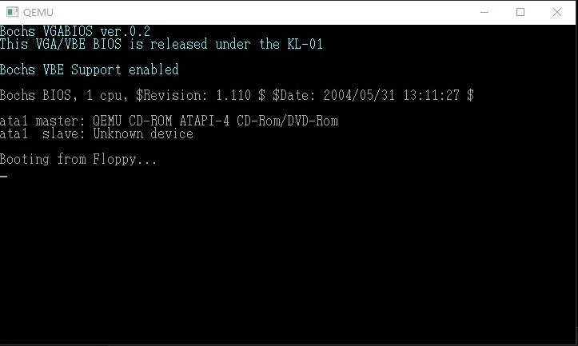
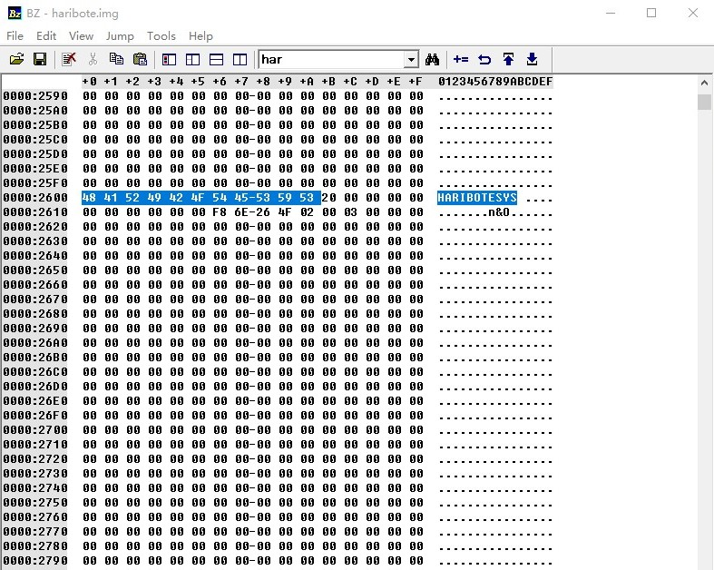
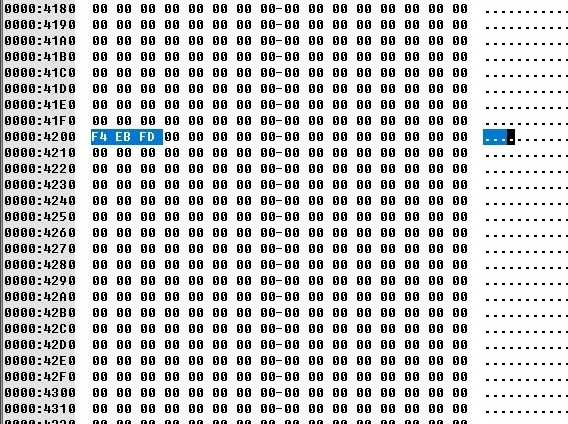
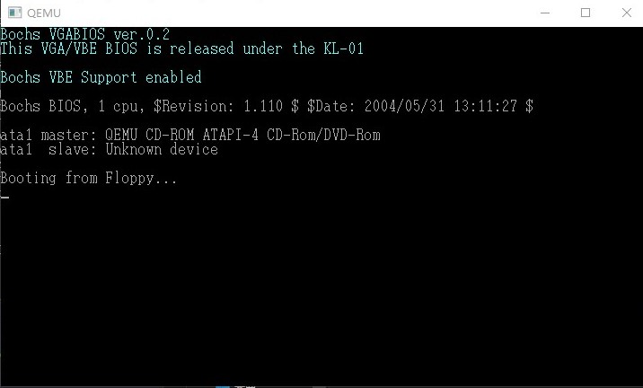
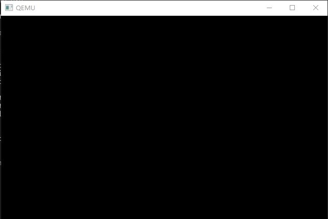
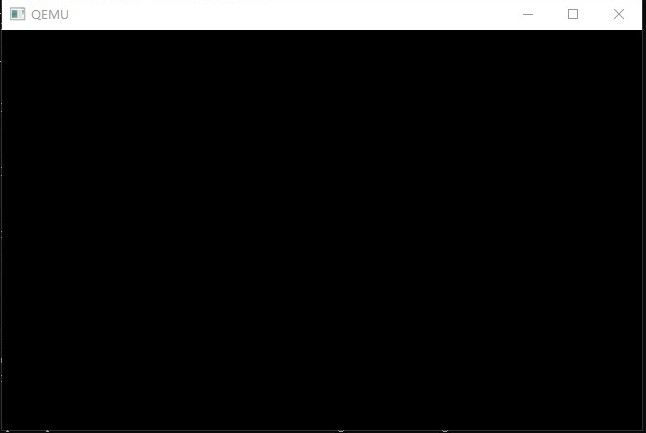

# day03

## 制作IPL

使用BIOS 0x13号函数读取磁盘。
```
AH=0X02 ;读盘
AH=0X03  ;写盘
AH=0X04  ;校验
AH=0X0C   ;寻道
AL=处理对象的扇区数  ;只能同时处理连续的扇区
CH=柱面号
CL=扇区号
DH=磁头号
DL=驱动器号
ES:BX=缓冲地址  ;校验和寻道时不使用
返回值：
flacs.cf = 0 无错误 AH==0
flacs.cf = 1 有错误 错误号码存入AH
```
* JC指令 如果进位标志是1

本次程序添加以下的内容：
```
    MOV   AX,0x0820
		MOV		ES,AX
		MOV		CH,0	;柱面
		MOV		DH,0	;磁头
		MOV		CL,2	;扇区
		MOV		AH,0x02	 ;读盘
		MOV		AL,1	;1个扇区
		MOV		BX,0  
		MOV		DL,0x00  ;a驱动器
		INT		0x13   ;调用磁盘bios
		JC		error
```
* 一张软盘有80个柱面，2个磁头，18个扇区，一个扇区512字节 因此一张软盘有1440KB
* 缓冲区ES:BX实际的内存地址是ES*16+BX
* makefile 文件中可以使用变量 来代替路径



## 添加试错
由于软盘存在不稳定的因素，因此要添加试错，如果连续读取磁盘超过五次失败，就会跳转到error，因此代码改进成如下内容！
```
MOV		AX,0x0820
MOV		ES,AX
MOV		CH,0			
MOV		DH,0			
MOV		CL,2			
;
MOV		SI,0			; 记录失败次数
retry:
MOV		AH,0x02			; AH=0x02 : 读盘
MOV		AL,1			
MOV		BX,0
MOV		DL,0x00		
INT		0x13			
JNC		fin				; 没有错误跳转到fin
ADD		SI,1			;SI+1
CMP		SI,5			; 比较次数
JAE		error			; SI >= 5 跳转到error
MOV		AH,0x00
MOV		DL,0x00			; A驱动器
INT		0x13			; 驱动器重置
JMP		retry
```

* JNC进位标志为0跳转
* JAE大于等于跳转


## 多读几个扇区
```
next:
		MOV		AX,ES		;内存地址后移
		ADD		AX,0x0020  
		MOV		ES,AX			
		ADD		CL,1			;cl+1
		CMP		CL,18			;判断是否到18
		JBE		readloop		
```

## 读入10柱面
```
    CYLS	EQU		10	 ;预先定义CYLS
    MOV		CL,1 ;读取反面
		ADD		DH,1
		CMP		DH,2   ;小于2 跳转
		JB		readloop		
		MOV		DH,0
		ADD		CH,1
		CMP		CH,CYLS
		JB		readloop		
```

## 着手开发操作系统

```
fin:
  HIT
  JMP fin
```
将以上内容保存到haribote.nas中，运行nask编译输出为haribote.sys

这是一个非常简短的程序，只是让系统hit，那么我们怎么来运行它呢？
如果你使用的是软盘的话只要执行以下操作：
1. 使用make install 命令将磁盘镜像写入软盘；
2. 在Windows中打开磁盘,将上面的haribote.sys保存到磁盘中
3. 使用工具将磁盘备份为磁盘镜像。

我们也可以通过edimg.exe来生成，但是在此之前，我们需要对makefile做一些更改：
```
haribote.sys : haribote.nas Makefile
	$(NASK) haribote.nas haribote.sys haribote.lst

haribote.img : ipl.bin haribote.sys Makefile
	$(EDIMG)   imgin:../z_tools/fdimg0at.tek \
		wbinimg src:ipl.bin len:512 from:0 to:0 \
		copy from:haribote.sys to:@: \
		imgout:haribote.img

```
在这之后我们就可以生成一个img文件啦！
之后，我们使用第一天使用过的二进制编辑器来打开我们的磁盘镜像，然后搜索我们添加进去的haribote
我们发现，一般向一个空的软盘保存文件时：
* 文件名会写在0x002600以后的位置；
* 文件内容会写在0x004200之后的位置。




**但是不幸的是！！！到这一步我们的系统并没有执行到我们写的那个简单的hit程序**

## 从启动区执行操作系统
我们知道，现在的程序是从启动区开始，将磁盘中的内容加载到内存的0x8000号内存中，那么我们写的程序就会加载到0x8000+0x4200中。
按我们就可以在haribote.nas中加上ORG 0xc200 然后在启动区的文件ipl.nas 文件中加上JMP 0xc200 这样我们的程序就会执行了！

我们来试一下！！！



**？？？你会发现好像没有什么不同！ 因为我们的这个程序本身是没有显示的，下面就让我们做一些事情，让它显示出来！**

## 操作系统的显示
我们当然可以显示一段文字，不过到了这个阶段，我们打算增加一点难度，切换一下画面模式。
```
; haribote-os
; TAB=4

		ORG		0xc200			
		MOV		AL,0x13		
		MOV		AH,0x00
		INT		0x10
fin:
		HLT
		JMP		fin
```
我们可以查找BIOS的函数得到以下的内容：
* AH = 0x00
* AL= 模式：
          * 0x03 16色字符模式
          * 0x12 VGA模式 648*480*4位色彩模式
          * 0x13 VGA模式 320*200*8位色彩模式
          * 0x6a 拓展VGA模式 800*600*4位色彩模式
也就是说我们的上面的程序，选择了320*200*8的色彩模式，如果画面正常的话会变成黑屏。


### 还做了以下更改

* ipl.nas 改成了ipl10.nas 表示这个程序只能读入10个柱面。
* 想要把磁盘装载内容的结束地址告诉haribote.sys 我们在JMP 前面添加了CYLS写入内存0x0ff0中。这样就完成了

  `MOV		[0x0ff0],CH	`
	`JMP		0xc200`

  **我们来试一下结果！！！**



***是不是成功啦！！！***


## 准备32位模式

首先需要说明的是，我们为什么不用16位的模式。32位模式可以使用的内存远大于1MB，CPU的自我保护功能在16位下是不能启动的。最重要的是C语言的编译器只能生成32位模式的机器语言，生成16位模式的机器语言较为困难。因此使用32位模式何乐而不为呢？

但是BIOS是用16位的汇编语言写成的，如果我们有事情需要bios来做只能写在开头做，后面进入32位模式就不能做了。  

那么我们需要BIOS来做什么呢？
画面的设定已经做完了，我们还需要从BIOS得到键盘的状态。因此我们对haribote.nas做了一些修改！
```
CYLS	EQU		0x0ff0			; 设定启动区
LEDS	EQU		0x0ff1
VMODE	EQU		0x0ff2			; 色彩的数目信息
SCRNX	EQU		0x0ff4			; 分辨率X
SCRNY	EQU		0x0ff6			; 分辨率Y
VRAM	EQU		0x0ff8			; 显示缓冲区起始地址

		ORG		0xc200			; 程序将要被装载的地方

		MOV		AL,0x13			;
		MOV		AH,0x00
		INT		0x10
		MOV		BYTE [VMODE],8	; 记录画面的模式
		MOV		WORD [SCRNX],320
		MOV		WORD [SCRNY],200
		MOV		DWORD [VRAM],0x000a0000

		MOV		AH,0x02
		INT		0x16 			; keyboard BIOS
		MOV		[LEDS],AL

fin:
		HLT
		JMP		fin
```

上面的获取键盘状态的指令也是在BIOS函数中查询的。我们除了设置了画面模式，还把画面的模式记录到内存中。以应对后面要支持不同的画面模式。我们暂且将这些启动信息称之为BOOT_INFO
* VRAM 是显存地址 范围是0xa0000-0xaffff

***到此32位模式已经差不多准备完了！***

## 导入C语言
### 程序中修改的内容
* haribote.sys 前半部分使用了汇编语言，后半部分使用C语言。生成前半部分的改名为了asmhead.nas 为了调用C语言写的程序,**添加了100行左右的代码**，这100多行代码现在先不着急看明白。下面我们先来看一下C语言写的程序！
```C
void HariMain(void)
{
fin:
//这里咩办法使用HLT
	goto fin;
}
```

### C语言怎么变成机器语言？
1. 首先使用cc1.exe从.c文件变成.gas文件
2. 使用gas2nask.exe 从 .gas文件生成nas文件
3. 使用nask.exe 从nas变成obj文件
4. 使用obi2bim.exe从obj变成bim文件
5. 使用bim2hrb.exe从bim变成hrb文件
6. 生成了机器语言，再使用copy指令将asmhead.bin和生成的.hrb文件结合生成了haribote.sys

* CC1 是C的编译器，可以把C语言编译为汇编语言源程序（笔者提供的，从GCC改编来的，GCC以gas汇编为基础，因此没办法用nask）
* gas2nask可以把gas汇编翻译成nask可以识别的汇编语言
* 转化位nask可识别的语言就简单很多 只需要使用nask转化为obj文件了
* 但是这样转化的obj文件并不能直接写入镜像还需要进行链接(现在先不用考虑)链接的工作交给了obj2bim
* 最后使用bim2hrb进行压缩和合并等加工的工作。


***最后我们的makefile文件也发生了变化，感兴趣的可以去看一下***

看一下努力出来的结果吧!



## 最后实现HLT
到这个时候，我们的系统已经可以执行我们写的C语言代码了，但是似乎是一个死循环，我们最后还要添加一个HLT指令，这个指令需要使用汇编语言来完成，然后在C语言中调用这个程序。

```
; naskfunc
; TAB=4

[FORMAT "WCOFF"]				;制作目标文件的模式
[BITS 32]						; 32位模式用的机械语言

;制作目标文件信息

[FILE "naskfunc.nas"]			; 源文件名

		GLOBAL	_io_hlt			; 程序中包含的函数名


; 函数的实际内容
[SECTION .text]		;目标文件中写了这些以后再写的内容

_io_hlt:	; void io_hlt(void);
		HLT
		RET

```

* 我们用汇编语言写了这个函数。函数名字叫做io_hlt  
* 用汇编语言写的程序也要和obj进行连接，因此要编译成目标文件。输出格式设置为WCOFF
* 设置32位机器语言模式
* 函数名称添加_为了更好的和C语言对接。

**然后我们写C语言调用这个函数**

```C
/* 告诉编译器有一个函数在别的文件中 */
void io_hlt(void);
void HariMain(void)
{
fin:
	io_hlt();
	goto fin;
}
```

##### 这样就大功告成啦！虽然运行起来还是一片黑色的窗口，不过已经具备HLT功能了。


## 最后解释一下makefile文件

```
TOOLPATH = ../z_tools/
INCPATH  = ../z_tools/haribote/
MAKE     = $(TOOLPATH)make.exe -r
NASK     = $(TOOLPATH)nask.exe
CC1      = $(TOOLPATH)cc1.exe -I$(INCPATH) -Os -Wall -quiet
GAS2NASK = $(TOOLPATH)gas2nask.exe -a
OBJ2BIM  = $(TOOLPATH)obj2bim.exe
BIM2HRB  = $(TOOLPATH)bim2hrb.exe
RULEFILE = $(TOOLPATH)haribote/haribote.rul
EDIMG    = $(TOOLPATH)edimg.exe
IMGTOL   = $(TOOLPATH)imgtol.com
COPY     = copy
DEL      = del

default :
	$(MAKE) img

ipl10.bin : ipl10.nas Makefile
	$(NASK) ipl10.nas ipl10.bin ipl10.lst

asmhead.bin : asmhead.nas Makefile
	$(NASK) asmhead.nas asmhead.bin asmhead.lst

bootpack.gas : bootpack.c Makefile
	$(CC1) -o bootpack.gas bootpack.c

bootpack.nas : bootpack.gas Makefile
	$(GAS2NASK) bootpack.gas bootpack.nas

bootpack.obj : bootpack.nas Makefile
	$(NASK) bootpack.nas bootpack.obj bootpack.lst

naskfunc.obj : naskfunc.nas Makefile
	$(NASK) naskfunc.nas naskfunc.obj naskfunc.lst

bootpack.bim : bootpack.obj naskfunc.obj Makefile
	$(OBJ2BIM) @$(RULEFILE) out:bootpack.bim stack:3136k map:bootpack.map \
		bootpack.obj naskfunc.obj
# 3MB+64KB=3136KB

bootpack.hrb : bootpack.bim Makefile
	$(BIM2HRB) bootpack.bim bootpack.hrb 0

haribote.sys : asmhead.bin bootpack.hrb Makefile
	copy /B asmhead.bin+bootpack.hrb haribote.sys

haribote.img : ipl10.bin haribote.sys Makefile
	$(EDIMG)   imgin:../z_tools/fdimg0at.tek \
		wbinimg src:ipl10.bin len:512 from:0 to:0 \
		copy from:haribote.sys to:@: \
		imgout:haribote.img

img :
	$(MAKE) haribote.img

run :
	$(MAKE) img
	$(COPY) haribote.img ..\z_tools\qemu\fdimage0.bin
	$(MAKE) -C ../z_tools/qemu

install :
	$(MAKE) img
	$(IMGTOL) w a: haribote.img

clean :
	-$(DEL) *.bin
	-$(DEL) *.lst
	-$(DEL) *.gas
	-$(DEL) *.obj
	-$(DEL) bootpack.nas
	-$(DEL) bootpack.map
	-$(DEL) bootpack.bim
	-$(DEL) bootpack.hrb
	-$(DEL) haribote.sys

src_only :
	$(MAKE) clean
	-$(DEL) haribote.img
```

当我们在命令行输入了`make run`时究竟发生了什么！
* 首先make 被解释为了`make.exe -r`，然后run需要`make img`和`copy`
* `make img`生成img文件需要`ipl10.bin haribote.sys Makefile`这三个文件
* makefile ipl10.bin这个文件之前就有，因此要sys文件（后面的makefile省略）
* sys 文件需要下面的文件 `asmhead.bin bootpack.hrb`
* bin文件需要`asmhead.nas ` hrb文件需要`bootpack.bim `
* nas文件是我们编写的，bim文件需要`bootpack.obj naskfunc.obj`来生成
* `naskfunc.obj`是我们所写的`naskfunc.nas`生成的
* `bootpack.obj `是C语言经过上面提到的过程得到的。
