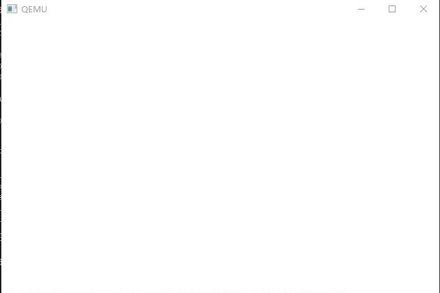

# day04
## 回顾昨天的内容
昨天我们首先制作了一个IPL，这个是参考BIOS的函数调用，我们可以读取软盘上的内容。然后我们给启动区添加了试错机制，防止一次读盘不成功就直接结束，我们可以让它多读几次。然后我们又尝试了多读几个扇区和柱面。接着我们着手开发操作系统，为操作系统添加了hit并且可以执行它。然后我们可以让图像显示在屏幕上。最后,我们导入了32位模式和C语言，并且用C语言实现了之前的HIT。

**但是我们的操作系统还是黑屏啊！这算什么操作系统？别着急，今天我们就来添加点不一样的内容！**


## 由黑到白的转变
昨天我们知道，VRAM是显存缓冲区，因此要想显示别的东西，就只要向VRAM中写入一些东西就好啦。但是我们并不能这样做，C语言并没有直接操作内存的语句。于是我们创建一个。我们需要向汇编语言的内容中添加以下的内容：

```
_write_mem8:	; void write_mem8(int addr, int data);
		MOV		ECX,[ESP+4]		; addr的内容存到ESP+4
		MOV		AL,[ESP+8]		; data的内容存到ESP+8中
		MOV		[ECX],AL
		RET
```
这样之后，我们C语言如果用到`write_mem8`这个函数的话，就会转到这里，参数也会像上面说的那样存放到ECX和AL，因为是32位的模式，这里用了32位的寄存器。因为这样有很多好处，这里不列举啦！

除此之外，还给naskfunc.nas添加了`INSTRSET`指令，告诉nask我们的程序给486用，方便将ECX读取为寄存器名称。

然后我们创建C语言的函数。
```C
void io_hlt(void);
void write_mem8(int addr, int data);
void HariMain(void)
{
	for (i = 0xa0000; i <= 0xaffff; i++) {
		write_mem8(i, 15);
	}    //i从0xa0000到0xaffff全部写入15
	for (;;) {
		io_hlt();
	}//无限循环调用hit
}

```
我们把VRAM所有的内存中写入了15 ，让我们来看一看结果。



**好了，我们现在白屏了！！！
可是为什么会这样呢？
因为我们向所所有的显存内写入的15 15是白色！ 但是这样好像没什么意思，我们继续做**

## 条纹出现了

怎么出现条纹呢？其实很简单，只需要把for循环做一下修改就可以实现了！
```C
for (i = 0xa0000; i <= 0xaffff; i++) {
  write_mem8(i, i & 0x0f);
}    //i从0xa0000到0xaffff全部写入15
```

* & 是与运算除此之外还有或非亦或运算 都是对二进制进行运算的，和加减乘除类似都是运算符。而他们是位运算符。
* 这里与之后是什么结果呢？
* 00 01 02 03 04 05 06 07 08 09 0A 0B 0C 0D 0E 0F 00 01 ……
* 每隔16像素就会循环一次！

**我们再来看一下结果吧 ！**


***继续继续别停下***

## 指针
前面我们说过，C语言没有直接写入指定内存的语句。我们可以用指针实现。`write_mem8(i,i 0x0f)`可以用`*i = i & 0x0f`代替。这样写的意思是：`MOV [0X1234],0X56` 但是我们并没有指定`0x56`所占用的内存空间，也就是BYTE 还是 WORD 或者DWORD 因此会报错。我们可以这样做:
`char *p`这样，我们就指定了p对应的内存大小。char相当于BYTE short 相当于WORD int相当于DWORD

之后，我们可以在运行一次试试看。


我们这里出现了一个警告！因为i的类型系统不能确定，因此赋值的时候会出现问题。但这只是一个warning。我们可以添加一个强制类型转换。
`p= (char *)i;`像这样！
